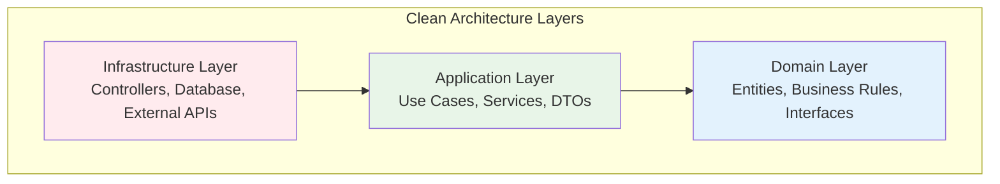

```mermaid
graph TB
    subgraph "Feature A"
        A1[UI Layer]
        A2[Business Logic]
        A3[Data Access]
        A1 --> A2
        A2 --> A3
    end
    
    subgraph "Feature B"
        B1[UI Layer]
        B2[Business Logic]
        B3[Data Access]
        B1 --> B2
        B2 --> B3
    end
    
    subgraph "Feature C"
        C1[UI Layer]
        C2[Business Logic]
        C3[Data Access]
        C1 --> C2
        C2 --> C3
    end
    
    style A1 fill:#e1f5fe
    style A2 fill:#f3e5f5
    style A3 fill:#e8f5e8
    style B1 fill:#e1f5fe
    style B2 fill:#f3e5f5
    style B3 fill:#e8f5e8
    style C1 fill:#e1f5fe
    style C2 fill:#f3e5f5
    style C3 fill:#e8f5e8
```

Choosing the right architectural pattern is crucial for long-term project success. This post compares two popular approaches in .NET development: **Clean Architecture** and **Vertical Slice Architecture**, based on insights from [From Layers to Features: Exploring Vertical Slice Architecture in .NET](https://medium.com/ascentic-technology/from-layers-to-features-exploring-vertical-slice-architecture-in-net-df1a05fd2fcf) and [Clean Architecture for C#](https://medium.com/@sanchitvarshney/clean-architecture-for-c-e0c6d00270a5).

## Understanding the Architectures

### Clean Architecture (Layered Approach)

**Clean Architecture** organizes code into concentric layers, with business logic at the center and external concerns at the outer layers.

```sh
┌─────────────────────────┐
│    Infrastructure       │  ← Database, APIs, UI
├─────────────────────────┤
│    Application          │  ← Use Cases, Services
├─────────────────────────┤
│    Domain               │  ← Business Logic, Entities
└─────────────────────────┘
```

Or visualized as a Mermaid diagram:



**Key Principles:**

- **Dependency Rule**: Dependencies point inward
- **Separation of Concerns**: Each layer has distinct responsibilities
- **Abstraction**: Inner layers define interfaces, outer layers implement them

### Vertical Slice Architecture (Feature-Based)

**Vertical Slice Architecture** organizes code around features or use cases, with each slice containing all the layers needed for that specific functionality.

```sh
┌──────────────┬─────────────┬──────────────┐
│  Feature A │  Feature B │  Feature C │
│ ┌────────┐  │ ┌────────┐  │ ┌────────┐   │
│ │   UI  │  │ │   UI  │  │ │   UI  │   │
│ ├────────┤  │ ├────────┤  │ ├────────┤   │
│ │ Logic │  │ │ Logic │  │ │ Logic │   │
│ ├────────┤  │ ├────────┤  │ ├────────┤   │
│ │  Data │  │ │  Data │  │ │  Data │   │
│ └────────┘  │ └────────┘  │ └────────┘   │
└─────────────┴──────────────┴──────────────┘
```

Or visualized as a Mermaid diagram:



**Key Principles:**

- **Feature Cohesion**: Related code stays together
- **Minimal Coupling**: Features are largely independent
- **End-to-End Ownership**: Each slice owns its complete workflow

## Clean Architecture Deep Dive

### Structure and Implementation

```csharp
// Domain Layer - Core business logic
public class User
{
    public int Id { get; private set; }
    public string Email { get; private set; }
    public DateTime CreatedAt { get; private set; }
    
    public void UpdateEmail(string email)
    {
        // Business rules and validation
        if (string.IsNullOrEmpty(email))
            throw new DomainException("Email cannot be empty");
            
        Email = email;
    }
}

// Application Layer - Use cases and orchestration
public class CreateUserUseCase
{
    private readonly IUserRepository _userRepository;
    private readonly IEmailService _emailService;
    
    public async Task<User> ExecuteAsync(CreateUserRequest request)
    {
        var user = new User(request.Email);
        await _userRepository.SaveAsync(user);
        await _emailService.SendWelcomeEmailAsync(user.Email);
        return user;
    }
}

// Infrastructure Layer - External concerns
public class UserRepository : IUserRepository
{
    private readonly DbContext _context;
    
    public async Task SaveAsync(User user)
    {
        _context.Users.Add(user);
        await _context.SaveChangesAsync();
    }
}
```

### Clean Architecture Pros

✅ **Clear Separation of Concerns**

- Business logic is isolated from infrastructure
- Easy to understand layer responsibilities
- Consistent project structure across teams

✅ **Testability**

- Domain logic can be unit tested in isolation
- Dependencies can be easily mocked
- Clear interfaces for testing boundaries

✅ **Technology Independence**

- Can swap databases, UI frameworks, or external services
- Business rules remain unchanged
- Framework-agnostic core

✅ **Team Scalability**

- Teams can work on different layers simultaneously
- Clear boundaries reduce conflicts
- Standardized patterns across projects

### Clean Architecture Cons

❌ **Over-Engineering for Simple Applications**

- Significant boilerplate for basic CRUD operations
- Can be overkill for small projects
- Steep learning curve for junior developers

❌ **Ceremony and Complexity**

- Multiple layers of abstraction
- Many interfaces and implementations
- Can lead to "abstraction paralysis"

❌ **Feature Scattering**

- Single feature spans multiple layers
- Changes require touching multiple files
- Harder to see complete feature flow

❌ **Shared Dependencies**

- Changes to shared components affect many features
- Potential for tight coupling between unrelated features
- Database schema changes impact multiple areas

## Vertical Slice Architecture Deep Dive

### Structure and Implementation

```csharp
// Features/Users/CreateUser/
// All code for CreateUser feature in one slice
namespace Features.Users.CreateUser
{
    // Request/Response
    public record CreateUserRequest(string Email);
    public record CreateUserResponse(int Id, string Email);
    
    // Handler - Contains all logic for this feature
    public class CreateUserHandler : IRequestHandler<CreateUserRequest, CreateUserResponse>
    {
        private readonly IDbContext _context;
        private readonly IEmailService _emailService;
        
        public async Task<CreateUserResponse> Handle(CreateUserRequest request, CancellationToken cancellationToken)
        {
            // Validation
            if (string.IsNullOrEmpty(request.Email))
                throw new ValidationException("Email is required");
            
            // Business logic
            var user = new User { Email = request.Email, CreatedAt = DateTime.UtcNow };
            
            // Data access
            _context.Users.Add(user);
            await _context.SaveChangesAsync(cancellationToken);
            
            // Side effects
            await _emailService.SendWelcomeEmailAsync(user.Email);
            
            return new CreateUserResponse(user.Id, user.Email);
        }
    }
    
    // Controller - Minimal, just routes to handler
    [ApiController]
    public class CreateUserController : ControllerBase
    {
        private readonly IMediator _mediator;
        
        [HttpPost("/users")]
        public async Task<CreateUserResponse> CreateUser(CreateUserRequest request)
        {
            return await _mediator.Send(request);
        }
    }
    
    // Validation - Feature-specific rules
    public class CreateUserValidator : AbstractValidator<CreateUserRequest>
    {
        public CreateUserValidator()
        {
            RuleFor(x => x.Email).NotEmpty().EmailAddress();
        }
    }
}
```

### Vertical Slice Architecture Pros

✅ **Feature Cohesion**

- All related code is co-located
- Easy to understand complete feature flow
- Changes are localized to single slice

✅ **Minimal Coupling Between Features**

- Features are largely independent
- Fewer shared abstractions
- Easier to modify or remove features

✅ **Faster Development**

- Less ceremony and boilerplate
- Direct path from request to response
- No need to navigate multiple layers

✅ **Easier Refactoring**

- Complete feature context in one place
- Changes are contained
- Less risk of breaking unrelated functionality

✅ **Better for Microservices**

- Natural boundaries for service extraction
- Features can evolve independently
- Easier to understand service scope

### Vertical Slice Architecture Cons

❌ **Potential Code Duplication**

- Common logic might be repeated across slices
- Similar patterns implemented differently
- No enforced consistency

❌ **Lacks Domain Modeling**

- Business rules scattered across handlers
- No central domain model
- Harder to ensure business rule consistency

❌ **Harder to Share Business Logic**

- Complex domain rules may be duplicated
- No clear place for cross-cutting concerns
- Risk of inconsistent business rule implementation

❌ **Testing Challenges**

- Handlers may have multiple responsibilities
- Integration tests become more important
- Unit testing might be more complex

## Detailed Comparison

### Code Organization

| Aspect | Clean Architecture | Vertical Slice |
|--------|-------------------|----------------|
| **Structure** | Horizontal layers (Domain, Application, Infrastructure) | Vertical features (Users, Orders, Products) |
| **File Location** | Grouped by technical concern | Grouped by business feature |
| **Dependencies** | Inner layers define interfaces | Features own their dependencies |
| **Coupling** | Between layers | Between slices (minimal) |

### Development Experience

| Aspect | Clean Architecture | Vertical Slice |
|--------|-------------------|----------------|
| **New Feature** | Touch multiple layers, create many files | Single slice, fewer files |
| **Bug Fix** | Navigate through layers | Everything in one place |
| **Code Review** | Changes spread across layers | Focused on single feature |
| **Onboarding** | Learn layer responsibilities | Understand feature flow |

### Maintenance and Evolution

| Aspect | Clean Architecture | Vertical Slice |
|--------|-------------------|----------------|
| **Refactoring** | Impact multiple layers | Contained within slice |
| **Testing** | Easy unit testing | Integration testing important |
| **Debugging** | Follow through layers | Linear flow within slice |
| **Documentation** | Layer responsibilities | Feature capabilities |

## When to Use Each Approach

### Choose Clean Architecture When

✅ **Complex Domain Logic**

- Rich business rules that need centralization
- Multiple features share complex domain concepts
- Need for sophisticated domain modeling

✅ **Large, Long-term Projects**

- Multiple teams working on different aspects
- Need for consistent patterns and structure
- Long-term maintainability is critical

✅ **Enterprise Applications**

- Strict separation of concerns required
- Multiple client applications
- Complex integration requirements

✅ **Team Expertise**

- Team understands architectural patterns
- Experience with dependency injection and abstractions
- Value consistency over speed

### Choose Vertical Slice Architecture When

✅ **Feature-Driven Development**

- Features are largely independent
- Rapid feature delivery is important
- Small to medium-sized applications

✅ **Microservices Architecture**

- Planning to extract services later
- Need clear feature boundaries
- Want to minimize coupling

✅ **Startup/Agile Environments**

- Need to move fast and iterate quickly
- Requirements change frequently
- Team prefers simplicity over structure

✅ **CRUD-Heavy Applications**

- Most operations are simple data manipulation
- Limited complex business logic
- Straightforward request/response patterns

## Hybrid Approaches

### Clean Architecture with Feature Folders

```
src/
├── Domain/
│   ├── Users/
│   │   ├── User.cs
│   │   └── IUserRepository.cs
│   └── Orders/
│       ├── Order.cs
│       └── IOrderRepository.cs
├── Application/
│   ├── Users/
│   │   ├── CreateUser/
│   │   └── UpdateUser/
│   └── Orders/
└── Infrastructure/
```

### Vertical Slices with Shared Kernel

```
src/
├── Features/
│   ├── Users/
│   │   ├── CreateUser/
│   │   └── UpdateUser/
│   └── Orders/
├── SharedKernel/
│   ├── Domain/
│   ├── Common/
│   └── Infrastructure/
```

## Migration Strategies

### From Clean Architecture to Vertical Slices

1. **Identify Feature Boundaries**
2. **Create Feature Folders**
3. **Move Related Use Cases Together**
4. **Inline Simple Abstractions**
5. **Extract Shared Components to Common**

### From Vertical Slices to Clean Architecture

1. **Extract Common Domain Models**
2. **Create Layer Boundaries**
3. **Define Interfaces and Abstractions**
4. **Separate Business Logic from Handlers**
5. **Implement Dependency Inversion**

## Real-World Considerations

### Performance Impact

- **Clean Architecture**: More abstraction layers may impact performance slightly
- **Vertical Slice**: More direct execution path, potentially better performance

### Team Size and Structure

- **Small Teams (1-5 developers)**: Vertical Slice often more suitable
- **Large Teams (10+ developers)**: Clean Architecture provides better coordination

### Application Complexity

- **Simple CRUD**: Vertical Slice reduces unnecessary complexity
- **Complex Business Logic**: Clean Architecture provides better organization

### Technology Stack

- **Modern .NET with MediatR**: Vertical Slice works well
- **Traditional N-tier**: Clean Architecture might be more familiar

## Conclusion

Both Clean Architecture and Vertical Slice Architecture have their place in modern .NET development:

**Clean Architecture** excels in:

- Complex domain-driven applications
- Large enterprise systems
- Long-term maintainability requirements
- Teams that value consistency and structure

**Vertical Slice Architecture** excels in:

- Feature-driven development
- Rapid iteration and delivery
- Microservices-oriented architectures
- Teams that prioritize simplicity and speed

The choice depends on your specific context: **team size, application complexity, business requirements, and long-term goals**.

Consider starting with Vertical Slice for new projects and evolving to Clean Architecture as complexity grows, or use hybrid approaches that combine the best of both worlds.

## References

- [From Layers to Features: Exploring Vertical Slice Architecture in .NET](https://medium.com/ascentic-technology/from-layers-to-features-exploring-vertical-slice-architecture-in-net-df1a05fd2fcf)
- [Clean Architecture for C#](https://medium.com/@sanchitvarshney/clean-architecture-for-c-e0c6d00270a5)
- [Clean Architecture by Robert C. Martin](https://blog.cleancoder.com/uncle-bob/2012/08/13/the-clean-architecture.html)
- [Vertical Slice Architecture by Jimmy Bogard](https://jimmybogard.com/vertical-slice-architecture/)
- [MediatR Documentation](https://github.com/jbogard/MediatR)
- [.NET Application Architecture Guides](https://learn.microsoft.com/en-us/dotnet/architecture/)
